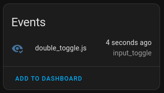
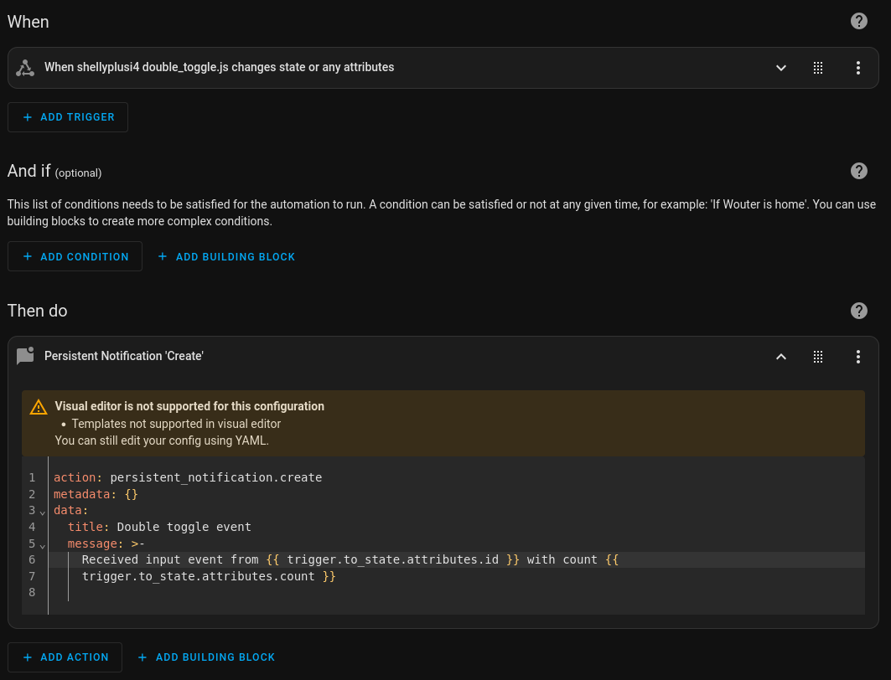
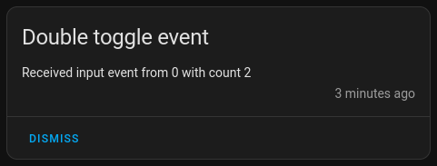

# Double toggle

Add multiple actions to a normal light switch

## Devices

This script is tested on the following devices:

- [Shelly Plus2PM](https://www.shelly.com/products/shelly-plus-2pm)
- [Shelly PlusI4](https://www.shelly.com/products/shelly-plus-i4)

## Features

- **Direct mode**: directly bind an input (with toggle amount) to an output of the device
- **Toggle delay**: The maximum amount of time between two input events to count as one

## Usage inside HA

This scripts emits the status as an event which will showup as an event entity inside Home Assistant 2025.3 or later.





```yaml
alias: Double Toggle automation
mode: single
triggers:
  - trigger: state
    entity_id:
      - event.shellyplusi4_double_toggle_js
conditions: []
actions:
  - action: persistent_notification.create
    metadata: {}
    data:
      title: Double toggle event
      message: >-
        Received input event from {{ trigger.to_state.attributes.id }} with
        count {{ trigger.to_state.attributes.count }}
```

The following automation will generate notification like this:



## Example use cases for double toggle

- Using it to turn off all the lights in a room
- Using it to control a fan inside a room
- Using it to trigger an automation

## LICENSE

The MIT License (MIT) - Copyright (c) 2025 Wouter (wjtje)

> Shelly is a trademark of SHELLY EUROPE LTD